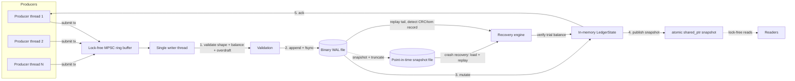

# Distributed Double-Entry Financial Ledger Engine

[](https://github.com/abhiishek306/financial-ledger/actions/workflows/ci.yml)

A crash-resilient, log-structured double-entry ledger engine written in
modern C++20, built the way a financial infrastructure team (think
Stripe/Google Payments-style internal ledger) would: durable
write-ahead-logging with `fsync`, a lock-free single-writer event loop,
copy-on-write snapshots for concurrent readers, idempotent request
deduplication, and a recovery path that is fuzz-tested against torn/partial
writes.

**Status: builds cleanly and all tests pass** on Ubuntu 24.04 with GCC 13
under `-Wall -Wextra -Wpedantic -Werror` plus
`-fsanitize=address,undefined` (see [Verified build & test results](#verified-build--test-results)).

## Why this project

This was built to demonstrate the kind of systems engineering judgment
expected in backend/infrastructure interviews: correctness under
concurrency, durability guarantees that survive a crash, and measured (not
assumed) performance trade-offs.

* **Correctness first**: every transaction is validated (balanced legs,
  overflow-checked arithmetic, overdraft bounds) *before* it's durable, and
  *before* it's visible to readers.
* **Durability you can crash-test**: a fault-injection test appends a torn
  WAL record (simulating `std::terminate()` or a partial disk write) and
  asserts recovery truncates the log and reconstructs an exactly-balanced
  ledger — never a corrupted or partial one.
* **Concurrency without locks on the hot path**: a lock-free MPSC ring buffer
  feeds a single writer thread; readers get wait-free access to consistent
  snapshots via `std::atomic<std::shared_ptr<const LedgerState>>`.
* **Measured trade-offs, not guesses**: Google Benchmark quantifies exactly
  what `fsync`-per-transaction costs vs. batched sync, in real numbers (below).

## Layout

```
include/ledger/     Public headers (types, WAL, ring buffer, engine, ...)
src/                Implementation + demo driver (main.cpp)
tests/              Assert-based unit tests + a crash/fault-injection test
benchmarks/         Google Benchmark microbenchmarks (opt-in, needs network)
.github/workflows/  CI: builds + tests on every push (Debug+sanitizers, Release)
```

## Architecture



## Design summary

| Phase | Component | Files |
|---|---|---|
| 1 | Domain types, `enum class AccountType/Direction`, `Result<T>` error handling, balance + overdraft validation | `types.hpp`, `result.hpp`, `validation.hpp/.cpp` |
| 2 | Binary WAL: `RecordHeader` + payload + CRC32 trailer, `BinaryWalWriter`/`BinaryWalReader` over raw POSIX fds (RAII `UniqueFd`), `SyncEveryWrite` vs `BatchSyncFlush` | `wal_format.hpp`, `wal_codec.hpp/.cpp`, `wal_writer.hpp/.cpp`, `wal_reader.hpp/.cpp` |
| 3 | Lock-free bounded MPSC ring buffer (Vyukov algorithm), fixed-capacity LRU idempotency cache (no heap allocation after construction), copy-on-write `std::atomic<std::shared_ptr<const LedgerState>>` snapshots, single-writer `LedgerEngine` event loop | `ring_buffer.hpp`, `idempotency_cache.hpp/.cpp`, `ledger_state.hpp/.cpp`, `engine.hpp/.cpp` |
| 4 | Point-in-time snapshotting (tmp-file + atomic `rename`), recovery engine (load snapshot → replay WAL → detect/truncate a corrupt or torn tail record → verify the global trial-balance invariant) | `snapshot.hpp/.cpp`, `recovery.hpp/.cpp` |
| 5 | Throughput/latency benchmarks, fault-injection test that simulates a crash mid-append | `benchmarks/bench_ledger.cpp`, `tests/fault_injection_test.cpp` |

### Key invariants enforced

* `validate_transaction_shape`: 2–16 legs, all amounts > 0, `sum(debits) == sum(credits)` (overflow-checked).
* `validate_transaction_against_state`: no debit-normal (Asset/Expense) account may drop below `-overdraft_limit`.
* Durability ordering in `LedgerEngine::process_pending`: WAL `append()` (with `fsync` per `SyncMode`) always happens **before** `LedgerState::apply()`.
* Recovery (`recovery::recover`) never returns success unless `validate_trial_balance` holds:
  `sum(Asset) + sum(Expense) - sum(Liability) - sum(Equity) - sum(Revenue) == 0`.

## Run it in one command (Docker, no toolchain needed)

```bash
docker run --rm ghcr.io/abhiishek306/financial-ledger:latest
```

This pulls a prebuilt image (Ubuntu 24.04 + GCC 13 build, tested with `ctest`
during the image build itself) and runs the concurrent-submit + crash-recovery
demo, printing the same output shown under [Verified build & test
results](#verified-build--test-results) below. The image is built and pushed
automatically by [`.github/workflows/docker-publish.yml`](.github/workflows/docker-publish.yml)
on every push to `main`.

## Building (Linux / WSL2 with a real distro)

This engine uses POSIX APIs directly (`open`/`write`/`fsync`/`pread`/`ftruncate`)
and requires GCC 12+ or Clang 16+ (for `std::atomic<std::shared_ptr<T>>`).
It does **not** build on Windows/MSVC or MinGW.

```bash
cmake -S . -B build -DCMAKE_BUILD_TYPE=RelWithDebInfo \
      -DLEDGER_ENABLE_SANITIZERS=ON            # add -fsanitize=address,undefined
cmake --build build -j
ctest --test-dir build --output-on-failure      # unit + fault-injection tests
./build/ledger_demo                             # concurrent-submit + recovery demo

# Optional (fetches Google Benchmark over the network):
cmake -S . -B build-bench -DLEDGER_BUILD_BENCHMARKS=ON -DLEDGER_BUILD_TESTS=OFF
cmake --build build-bench -j
./build-bench/benchmarks/bench_ledger
```

Compiler flags: `-Wall -Wextra -Wpedantic -Werror` are applied to all targets
that link `ledger_core`; `-DLEDGER_ENABLE_SANITIZERS=ON` adds
`-fsanitize=address,undefined`.

## Verified build & test results

Built and executed on **Ubuntu 24.04.4 LTS, GCC 13.3.0** (via WSL2), with
zero warnings under `-Wall -Wextra -Wpedantic -Werror`:

```
$ cmake -S . -B build -G Ninja -DCMAKE_BUILD_TYPE=Debug -DLEDGER_ENABLE_SANITIZERS=ON
$ cmake --build build          # clean build, 0 warnings/errors, ASan+UBSan instrumented
$ ctest --test-dir build --output-on-failure
    Start 1: test_validation ..................   Passed
    Start 2: test_wal .........................   Passed
    Start 3: fault_injection_test .............   Passed
100% tests passed, 0 tests failed out of 3

$ ./build/ledger_demo           # 4 producer threads x 500 tx, under ASan+UBSan
accepted=2000 rejected=0
cash balance=-20000 revenue balance=-20000
recovery OK: cash=-20000 revenue=-20000
```

A Release build (`-DCMAKE_BUILD_TYPE=Release`, no sanitizers) also compiles
cleanly and passes the same 3/3 tests.

### Benchmark results (Google Benchmark, Release build, 12-core host)

```
Benchmark                                      Time             CPU   Iterations UserCounters...
------------------------------------------------------------------------------------------------
BM_InMemoryApply                            24.0 ns         24.0 ns     18464672 items_per_second=41.6M/s
BM_EndToEnd_SyncEveryWrite               2606475 ns       115211 ns         1000 items_per_second=8.68k/s
BM_EndToEnd_BatchSync                      23691 ns         3352 ns       100000 items_per_second=298k/s
BM_LatencyPercentiles/iterations:2000    2625867 ns       113772 ns         2000 P50=2.42ms P95=3.94ms P99=5.11ms
```

Takeaways: pure in-memory validation+apply does ~41.6M tx/sec; batching WAL
`fsync()` calls (every 128 transactions instead of every 1) improves
end-to-end throughput by **~34x** (8.68k/s → 298k/s) on this virtualized
disk — the expected, measurable cost of the durability-vs-throughput
trade-off `SyncMode` exposes. (Absolute fsync latency will be lower on
bare-metal NVMe; the ratio between the two modes is the meaningful result.)

## CI

[`.github/workflows/ci.yml`](.github/workflows/ci.yml) builds and tests the
project on every push/PR across Debug (with ASan/UBSan) and Release configs
on `ubuntu-24.04`.
